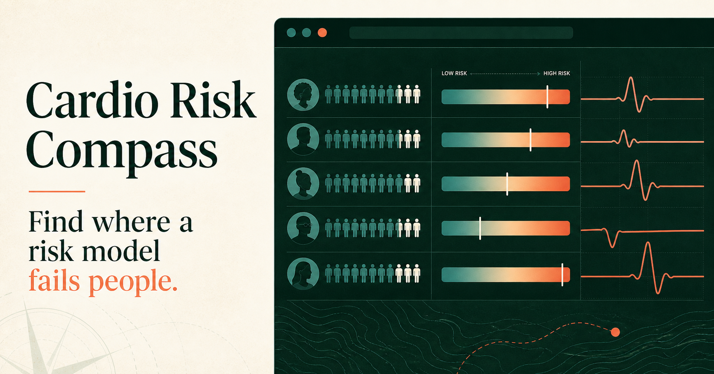

# Cardio Risk Compass

**Find where a cardiovascular risk model performs differently across patient populations—before those differences influence care.**

[Try the live browser demo](https://dbbun.github.io/cardio-risk-compass/) · [Read the scientific foundation](https://doi.org/10.1038/s41598-022-16615-3)



Cardio Risk Compass is a browser-based model-assurance workbench developed by [DBbun](https://github.com/DBbun). It analyzes patient-level model outputs across populations, explains performance and fairness findings in clinical language, and turns those findings into concrete review tasks.

The public demonstration uses a reproducible **100,000-patient synthetic cohort**. Its results illustrate the workflow and are not clinical evidence. Uploaded CSV files are processed locally in the visitor's browser and are not transmitted by the application.

## Why it matters

A model can appear acceptable overall while behaving differently within populations defined by age, sex, race, language, location, socioeconomic deprivation, or clinical history. Cardio Risk Compass helps a healthcare team distinguish among:

- weak ranking performance;
- population-specific underprediction or overprediction;
- missed cases or unnecessary alerts created by a shared decision threshold;
- data-quality, representation, and small-sample concerns.

In the synthetic demonstration, pooled discrimination is higher than discrimination within every age band. The largest sex-related classification differences concentrate in ages 65–74, while the displayed race-related differences remain comparatively small. These are deliberately visible demonstration findings, not claims about real patients.

## What the tool does

1. Loads the built-in demonstration or a patient-level CSV.
2. Pairs a binary clinical outcome with its predicted-risk score.
3. Defines the patient characteristic, reference population, and comparison population.
4. Optionally combines a second characteristic for intersectional analysis.
5. Applies a configurable risk threshold.
6. Displays population distributions, age-stratified performance, fairness measures, 95% confidence intervals, and responsive recommendations.

The demonstration includes:

- **Atrial fibrillation:** five-year observed outcome with CHARGE-AF predicted risk.
- **Atherosclerotic cardiovascular disease:** ten-year observed outcome with Pooled Cohort Equations predicted risk.

## CSV structure

Users do not need to memorize a fixed schema. The in-app guide explains the required columns, provides a downloadable example, and classifies compatible columns automatically.

At minimum, a CSV needs:

| Column role | Required values | Example |
|---|---|---|
| Observed outcome | Binary `0` or `1` | `af_5yr_outcome` |
| Predicted probability | Numeric value from `0` to `1` | `charge_af_risk` |
| Population characteristic | Categorical population values | `sex`, `race`, `native_english` |

Optional covariates can include age, age band, body mass index, blood pressure, cholesterol, smoking, diabetes, hypertension, treatment status, heart failure, prior myocardial infarction, deprivation, and location. Missing or unknown population values remain visible for data-quality review.

## Measures reported

### Model performance and reliability

- Area under the receiver operating characteristic curve (AUC)
- Sensitivity and specificity
- Brier score
- Observed-to-expected outcome ratio
- Outcome prevalence and model-positive rate
- Positive predictive value
- False-positive and false-negative rates

### Directional fairness measures

Directional differences are calculated as **comparison population minus reference population**.

- Statistical parity difference
- True-positive-rate difference
- True-negative-rate difference
- False-positive-rate difference
- False-negative-rate difference
- Positive predictive-value difference
- Disparate-impact ratio
- Equalized-odds gap
- Observed-to-expected calibration difference

Metrics are suppressed for populations with fewer than 30 records. Applicable chart estimates include 95% confidence intervals. A difference is a review signal—not proof of discrimination—and must be interpreted with prevalence, uncertainty, data quality, and clinical consequences.

## From measurement to action

Recommendations respond to the selected endpoint, population comparison, reference population, intersection, and threshold. The tool guides users through:

- local recalibration review;
- threshold-impact simulation;
- missingness and representation checks;
- targeted review of age bands where a disparity concentrates;
- reassessment after recalibration, threshold changes, or retraining.

## Scientific foundation

Kartoun U, Khurshid S, Kwon BC, et al. [Prediction performance and fairness heterogeneity in cardiovascular risk models](https://doi.org/10.1038/s41598-022-16615-3). *Scientific Reports*. 2022;12:12542.

The publication evaluated CHARGE-AF and Pooled Cohort Equations performance across clinically relevant subpopulations in three large datasets. Cardio Risk Compass adapts that measurement approach into an interactive model-assurance workflow.

## Run locally

Requirements: Node.js 22.13 or later.

```bash
npm install
npm run dev
```

Build and preview the static GitHub Pages version:

```bash
npm run build:pages
npm run preview:pages
```

Every push to `main` deploys the browser-only application through GitHub Actions.

## Limitations

Cardio Risk Compass supports model evaluation and governance. Its metrics and recommendations do not establish causation, prove unlawful bias, or determine patient-level treatment. Real-world use requires representative local data, clinical review, statistical validation, and appropriate governance.

## License

Copyright © 2026 DBbun LLC. All rights reserved. See [LICENSE](LICENSE). Public visibility of this repository does not grant permission to copy, modify, distribute, sublicense, or use the software except as permitted by applicable law or a separate written agreement.
